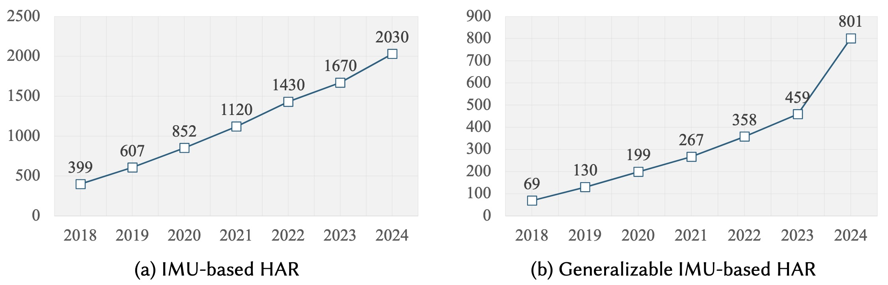

# Towards Generalizable Human Activity Recognition: A Survey

>The organization of this repository refers to our paper [Towards Generalizable Human Activity Recognition: A Survey](https://arxiv.org/abs/2508.12213). We have summarized extensive datasets, papers, and other resources for IMU-based human activity recognition (HAR). 

>If you find this repository useful, please feel free to [cite our paper](#citation).

## The Trends of IMU-based HAR

Here are the growth trends of cumulative publications per year (source: Google Scholar).



The statistics illustrate the cumulative number of publications per year retrieved from Google Scholar using two search queries:
(a) "IMU" AND "Human Activity Recognition"
(b) "IMU" AND "Human Activity Recognition" AND "Generalization".

The results demonstrate that IMU-based HAR has garnered steadily increasing research attention over the past decade. Furthermore, given the persistent challenges posed by domain shifts and data heterogeneity, there has been a notable surge in recent years in studies adopting generalizable learning paradigms.

## Table of Contents

- [The Trends of IMU-based HAR](#the-trends-of-imu-based-har)
- [Generalization-Oriented Training Settings](#generalization-oriented-training-settings)
    - [Within-Group](#within-group)
    - [Cross-Person](#cross-person)
    - [Cross-Device](#cross-device)
    - [Cross-Position](#cross-position)
    - [Cross-Activity](#cross-activity)
    - [Cross-Dataset](#cross-dataset)
- [Datasets and Benchmarks](#datasets-and-benchmarks)
    - [IMU-Only Dataset](#imu-only-dataset)
    - [Multimodal Dataset](#multimodal-dataset)
    - [Dataset Library](#dataset-library)
    - [Tools and Benchmarks](#tools-and-benchmarks)
- [Model-Centric Methodology](#model-centric-methodology)
    - [Supervised Learning](#supervised-learning)
        - [Feature Invariance](#feature-invariance)
        - [Concept Invariance](#concept-invariance)
        - [Multi-Task Learning](#multi-task-learning)
        - [Federated Learning](#federated-learning)
    - [Weakly-Supervised Learning](#weakly-supervised-learning)
        - [Semi-Supervised Learning](#semi-supervised-learning)
        - [Active Learning](#active-learning)
        - [Inexact Supervised Learning](#inexact-supervised-learning)
    - [Unsupervised Learning](#unsupervised-learning)
        - [Clustering Analysis](#clustering-analysis)
        - [Association Analysis](#association-analysis)
    - [Self-Supervised Learning](#self-supervised-learning)
        - [Transformation Recognition](#transformation-recognition)
        - [Reconstruction](#reconstruction)
        - [Contrastive Learning](#contrastive-learning)
        - [Hybrid Approaches](#hybrid-approaches)
    - [LLM-based Learning](#llm-based-learning)
        - [LLM-Assisted Enhancer](#llm-assisted-enhancer)
        - [LLM-Centered Classifier](#llm-centered-classifier)
        - [LLM-Empowered Agent](#llm-empowered-agent)
- [Data-Centric Methodology](#data-centric-methodology)
    - [Multi-Modal Fusion](#multi-modal-fusion)
    - [Cross-Modal Learning](#cross-modal-learning)
        - [Cross-Modal Conversion](#cross-modal-conversion)
        - [Cross-Modal Contrastive](#cross-modal-contrastive)
    - [Data Augmentation](#data-augmentation)
- [Applications](#applications)
    - [Healthcare and Rehabilitation](#healthcare-and-rehabilitation)
    - [Sports and Fitness Monitoring](#sports-and-fitness-monitoring)
    - [Work Assessment](#work-assessment)
    - [Smart Home and Assisted Living](#smart-home-and-assisted-living)
    - [Transportation and Mobility](#transportation-and-mobility)
    - [Human-Robot Interaction](#human-robot-interaction)
    - [AR and VR Interaction](#ar-and-vr-interaction)
    - [Embodied Agents](#embodied-agents)
- [Fancy Applications of IMU Sensing](#fancy-applications-of-imu-sensing)
- [Citation](#citation)

## Generalization-Oriented Training Settings

### Within-Group

1. **"Ensembles of deep lstm learners for activity recognition using wearables"**. *Guan et al.* IMWUT 2017. [[Paper](https://dl.acm.org/doi/abs/10.1145/3090076)]
2. **"Label Propagation: An Unsupervised Similarity Based Method for Integrating New Sensors in Activity Recognition Systems"**. *Rey et al.* IMWUT 2017. [[Paper](https://dl.acm.org/doi/abs/10.1145/3130959)]
3. **"Unleashing the Power of Shared Label Structures for Human Activity Recognition"**. *Zhang et al.* CIKM 2023. [[Paper](https://dl.acm.org/doi/abs/10.1145/3583780.3615101)]
4. **"Decomposing and Fusing Intra-and Inter-Sensor Spatio-Temporal Signal for Multi-Sensor Wearable Human Activity Recognition"**. *Xie et al.* AAAI 2025. [[Paper](https://ojs.aaai.org/index.php/AAAI/article/view/33582)]

### Cross-Person

1. **"Deep, Convolutional, and Recurrent Models for Human Activity Recognition using Wearables"**. *Hammerla et al.* IJCAI 2016. [[Paper](https://arxiv.org/abs/1604.08880)]
2. **"XHAR: Deep Domain Adaptation for Human Activity Recognition with Smart Devices"**. *Zhou et al.* SECON 2020. [[Paper](https://ieeexplore.ieee.org/abstract/document/9158431)]
3. **"Incremental Real-Time Personalization in Human Activity Recognition Using Domain Adaptive Batch Normalization"**. *Mazankiewicz et al.* IMWUT 2020. [[Paper](https://dl.acm.org/doi/abs/10.1145/3432230)]
4. **"Latent Independent Excitation for Generalizable Sensor-based Cross-Person Activity Recognition"**. *Qian et al.* AAAI 2021. [[Paper](https://ojs.aaai.org/index.php/AAAI/article/view/17416)]
5. **"Domain Generalization for Activity Recognition via Adaptive Feature Fusion"**. *Qin et al.* TIST 2022. [[Paper](https://dl.acm.org/doi/full/10.1145/3552434)]
6. **"SWL-Adapt: An Unsupervised Domain Adaptation Model with Sample Weight Learning for Cross-User Wearable Human Activity Recognition"**. *Hu et al.* AAAI 2023. [[Paper](https://ojs.aaai.org/index.php/AAAI/article/view/25743)]
7. **"Optimization-Free Test-Time Adaptation for Cross-Person Activity Recognition"**. *Wang et al.* IMWUT 2024. [[Paper](https://dl.acm.org/doi/abs/10.1145/3631450)]
8. **"SF-Adapter: Computational-Efficient Source-Free Domain Adaptation for Human Activity Recognition"**. *Kang et al.* IMWUT 2024. [[Paper](https://dl.acm.org/doi/abs/10.1145/3631428)]
9. **"DIVERSIFY: A General Framework for Time Series Out-of-distribution Detection and Generalization"**. *Lu et al.* TPAMI 2024. [[Paper](https://ieeexplore.ieee.org/document/10402053)]
10. **"Cross-Domain HAR: Few-Shot Transfer Learning for Human Activity Recognition"**. *Thukral et al.* TIST 2025. [[Paper](https://dl.acm.org/doi/full/10.1145/3704921)]
11. **"Generalizable Sensor-Based Activity Recognition via Categorical Concept Invariant Learning"**. *Xiong et al.* AAAI 2025. [[Paper](https://arxiv.org/abs/2412.13594)]

### Cross-Device

1. **"XHAR: Deep Domain Adaptation for Human Activity Recognition with Smart Devices"**. *Zhou et al.* SECON 2020. [[Paper](https://ieeexplore.ieee.org/abstract/document/9158431)]
2. **"ColloSSL: Collaborative Self-Supervised Learning for Human Activity Recognition"**. *Jain et al.* IMWUT 2022. [[Paper](https://dl.acm.org/doi/abs/10.1145/3517246)]
3. **"HyperHAR: Inter-sensing Device Bilateral Correlations and Hyper-correlations Learning Approach for Wearable Sensing Device Based Human Activity Recognition"**. *Ahmad et al.* IMWUT 2024. [[Paper](https://dl.acm.org/doi/abs/10.1145/3643511)]
4. **"UniMTS: Unified Pre-training for Motion Time Series"**. *Zhang et al.* NeurIPS 2024. [[Paper](https://proceedings.neurips.cc/paper_files/paper/2024/hash/c290d4373c495b2cad0625d6288260f0-Abstract-Conference.html)]

### Cross-Position

1. **"Cross-position activity recognition with stratified transfer learning"**. *Chen et al.* PMC 2019. [[Paper](https://www.sciencedirect.com/science/article/abs/pii/S1574119218303432)]
2. **"A Systematic Study of Unsupervised Domain Adaptation for Robust Human-Activity Recognition"**. *Chang et al.* IMWUT 2020. [[Paper](https://dl.acm.org/doi/abs/10.1145/3380985)]
3. **"Semantic-Discriminative Mixup for Generalizable Sensor-based Cross-domain Activity Recognition"**. *Lu et al.* IMWUT 2022. [[Paper](https://dl.acm.org/doi/abs/10.1145/3534589)]
4. **"DIVERSIFY: A General Framework for Time Series Out-of-distribution Detection and Generalization"**. *Lu et al.* TPAMI 2024. [[Paper](https://ieeexplore.ieee.org/document/10402053)]
5. **"Cross-Domain HAR: Few-Shot Transfer Learning for Human Activity Recognition"**. *Thukral et al.* TIST 2025. [[Paper](https://dl.acm.org/doi/full/10.1145/3704921)]
6. **"Generalizable Sensor-Based Activity Recognition via Categorical Concept Invariant Learning"**. *Xiong et al.* AAAI 2025. [[Paper](https://arxiv.org/abs/2412.13594)]

### Cross-Activity

1. **"NuActiv: recognizing unseen new activities using semantic attribute-based learning"**. *Cheng et al.* MobiSys 2013. [[Paper](https://dl.acm.org/doi/abs/10.1145/2462456.2464438)]
2. **"UniMTS: Unified Pre-training for Motion Time Series"**. *Zhang et al.* NeurIPS 2024. [[Paper](https://proceedings.neurips.cc/paper_files/paper/2024/hash/c290d4373c495b2cad0625d6288260f0-Abstract-Conference.html)]
3. **"ZeroHAR: Sensor Context Augments Zero-Shot Wearable Action Recognition"**. *Chowdhury et al.* AAAI 2025. [[Paper](https://ojs.aaai.org/index.php/AAAI/article/view/33762)]

### Cross-Dataset

1. **"Cross-dataset deep transfer learning for activity recognition"**. *Qin et al.* UbiComp 2019. [[Paper](https://dl.acm.org/doi/abs/10.1145/3341162.3344865)]
2. **"Cross-Dataset Activity Recognition via Adaptive Spatial-Temporal Transfer Learning"**. *Qin et al.* IMWUT 2020. [[Paper](https://dl.acm.org/doi/abs/10.1145/3369818)]
3. **"Semantic-Discriminative Mixup for Generalizable Sensor-based Cross-domain Activity Recognition"**. *Lu et al.* IMWUT 2022. [[Paper](https://dl.acm.org/doi/abs/10.1145/3534589)]
4. **"GLOBEM: Cross-Dataset Generalization of Longitudinal Human Behavior Modeling"**. *Xu et al.* IMWUT 2023. [[Paper](https://dl.acm.org/doi/abs/10.1145/3569485)]
5. **"CrossHAR: Generalizing Cross-dataset Human Activity Recognition via Hierarchical Self-Supervised Pretraining"**. *Hong et al.* IMWUT 2024. [[Paper](https://dl.acm.org/doi/abs/10.1145/3659597)]
6. **"GOAT: A Generalized Cross-Dataset Activity Recognition Framework with Natural Language Supervision"**. *Miao et al.* IMWUT 2024. [[Paper](https://dl.acm.org/doi/abs/10.1145/3699736)]
7. **"DIVERSIFY: A General Framework for Time Series Out-of-distribution Detection and Generalization"**. *Lu et al.* TPAMI 2024. [[Paper](https://ieeexplore.ieee.org/document/10402053)]
8. **"HAR-DoReMi: Optimizing Data Mixture for Self-Supervised Human Activity Recognition Across Heterogeneous IMU Datasets"**. *Ban et al.* arXiv 2025. [[Paper](https://arxiv.org/abs/2503.13542)]
9. **"LLM4HAR: Generalizable On-device Human Activity Recognition with Pretrained LLMs"**. *Hong et al.* KDD 2025. [[Paper](https://dl.acm.org/doi/abs/10.1145/3711896.3737226)]
10. **"MobHAR: Source-free Knowledge Transfer for Human Activity Recognition on Mobile Devices"**. *Xue et al.* IMWUT 2025. [[Paper](https://dl.acm.org/doi/abs/10.1145/3712620)]
11. **"Generalizable Sensor-Based Activity Recognition via Categorical Concept Invariant Learning"**. *Xiong et al.* AAAI 2025. [[Paper](https://arxiv.org/abs/2412.13594)]
12. **"One Model to Fit Them All: Universal IMU-based Human Activity Recognition with LLM-assisted Cross-dataset Representation"**. *Wei et al.* IMWUT 2025. [[Paper](https://dl.acm.org/doi/10.1145/3749509)]

## Datasets and Benchmarks

### IMU-Only Dataset

| Dataset | Subjects | Sensors | Activities | datasize | Year |
| --- | --- | --- | --- | --- | --- |
| [CAPTURE-24](https://www.nature.com/articles/s41597-024-03960-3) | 151 | acc | 200 unique labels | 3883 h | 2024 |
| [TNDA-HAR](https://ieee-dataport.org/open-access/tnda-har-0) | 23 | acc, gyro | 8 daily activities | 5.7 h | 2021 |
| [KU-HAR](https://data.mendeley.com/datasets/45f952y38r/5) | 90 | acc, gyro | 18 daily activities | - | 2021 |
| [HARSense](https://ieee-dataport.org/open-access/harsense-statistical-human-activity-recognition-dataset) | 12 | acc, gyro | 6 daily activities | - | 2021 |
| [HAR70+](https://archive.ics.uci.edu/dataset/780/har70) | 18 | acc | 8 daily activities | 12.6 h | 2020 |
| [WISDM](https://archive.ics.uci.edu/dataset/507/wisdm+smartphone+and+smartwatch+activity+and+biometrics+dataset) | 51 | acc, gyro | 18 daily activities | 91.8 h | 2019 |
| [MotionSense](https://github.com/mmalekzadeh/motion-sense)| 24 | acc, gyro | 6 daily activities | - | 2019 
| [SHL Challenge](http://www.shl-dataset.org/challenges/) | 3 | acc, gyro, mag | 8 transportation modes | 2812 h | 2018 | 
| [UniMiB SHAR](http://www.sal.disco.unimib.it/technologies/unimib-shar/) | 30 | acc | 17 daily, fall activities | - | 2017 |
| [UMAFall](https://figshare.com/articles/dataset/UMA_ADL_FALL_Dataset_zip/4214283) | 17 | acc, gyro, mag | 11 daily, fall activities | 2.2h | 2017 |
| [MobiAct](https://bmi.hmu.gr/the-mobifall-and-mobiact-datasets-2/) | 57 | acc, gyro | 13 daily, fall activities | - | 2016 |  
| [Shoaib](https://www.utwente.nl/en/eemcs/ps/research/dataset/) | 10 | acc, gyro, mag | 13 daily activities | 6.5 h | 2016 |  
| [HHAR](https://archive.ics.uci.edu/dataset/344/heterogeneity+activity+recognition) | 9 | acc, gyro | 6 daily activities | - | 2015 |
| [HAPT](https://archive.ics.uci.edu/dataset/341/smartphone+based+recognition+of+human+activities+and+postural+transitions) | 30 | acc, gyro | 6 static, dynamic activities | - | 2015 |
| [REALDISP](https://archive.ics.uci.edu/dataset/305/realdisp+activity+recognition+dataset) | 17 | acc, gyro, mag | 33 daily, fitness activities | - | 2014 | 
| [WHARF](https://github.com/fulviomas/WHARF) | 16 | acc | 8 motion primitives | - | 2013 |  
| [DSADS](https://archive.ics.uci.edu/dataset/256/daily+and+sports+activities) | 8 | acc, gyro, mag | 19 daily, sports activities | 12.7 h | 2013 | 
| [UCI-HAR](https://archive.ics.uci.edu/dataset/240/human+activity+recognition+using+smartphones) | 30 | acc, gyro | 6 daily activities | - | 2012 | 
| [USC-HAD](https://sipi.usc.edu/had/) | 14 | acc, gyro, mag | 12 daily activities | - | 2012  
| [Daphnet FoG](https://archive.ics.uci.edu/dataset/245/daphnet+freezing+of+gait) | 10 | acc | 3 walking activities | 8.3 h | 2009 | 
| [Skoda Mini Checkpoint](http://har-dataset.org/lib/exe/fetch.php?media=wiki:dataset:skodaminicp:skodaminicp_2015_08.zip) | 1 | acc, 3D acc sensor | 10 assembly-line activities | - | 2008 |

### Multimodal Dataset

| Dataset | Subjects | Sensors | Activities | datasize | Year |
| --- | --- | --- | --- | --- | --- |
| [OctoNet](https://huggingface.co/datasets/hku-aiot/OctoNet) | 41 | acc, gyro, mag, RGB-D, ToF, Thermal, IRA, mmWave, UWB, Wi-Fi, acoustic, heart rate, MoCap | 62 comprehensive activities | - | 2025 |
| [DCM](https://osf.io/fbmxy/overview) | 30 | acc, gyro, mmWave, skeleton | 10 daily activities | - | 2025 |
| [RecGym](https://zhaxidele.github.io/RecGym/) | 10 | acc, gyro, human body capacitance sensor | 12 fitness activities | 50 h | 2025 |
| [WEAR](https://mariusbock.github.io/wear/) | 22 | acc, video | 18 sports activities | 19 h | 2024 |
| [iSPL](https://github.com/thunguyenth/HAR_IMU_Stretch) | 1 | acc, gyro, stretch | 9 daily activities | - | 2022 |
| [HARTH](https://archive.ics.uci.edu/dataset/779/harth) | 22 | acc, video | 12 daily activities | 35.9 h | 2021 |
| [w-HAR](https://github.com/gmbhat/human-activity-recognition) | 22 | acc, gyro, stretch sensor | 7 daily activities | 3 h | 2020 | 
| [RealLifeHAR](https://lbd.udc.es/research/real-life-HAR-dataset/) | 19 | acc, gyro, mag, GPS | 4 daily activities | - | 2020 | 
| [MMAct](https://mmact19.github.io/2019/) | 40 | RGB-video, keypoints, acc,  gyro, ori, Wi-Fi, pressure | 37 daily, abnormal, desk work activities | - | 2019 |  
| [HuGaDB](https://github.com/romanchereshnev/HuGaDB?tab=readme-ov-file) | 18 | acc, gyro, EMG | 12 activities | 10 h | 2018 | 
| [RealWorld HAR](https://www.uni-mannheim.de/dws/research/projects/activity-recognition/dataset/dataset-realworld/) | 15 | acc, gyro, mag, GPS, light, sound level | 8 daily activities | 124.3h | 2016 | 
| [ExtraSensory](http://extrasensory.ucsd.edu/) | 60 | acc, gyro, mag, location, audio, additional | 51 activities | - | 2016 | 
| [UTD-MHAD](https://personal.utdallas.edu/~kehtar/UTD-MHAD.html) | 8 | RGB video, depth video, skeleton positions, acc, gyro | 27 daily, sports activities,  gestures | - | 2015 |  
| [MHEALTH](https://archive.ics.uci.edu/dataset/319/mhealth+dataset) | 10 | acc, gyro, mag, ECG | 12 daily activities | - | 2014 |  
| [Berkeley MHAD](https://ieeexplore.ieee.org/document/6474999) | 12 | acc, optical capture system, video, depth sensor, audio | 11 daily activities | 1.37 h | 2013 | 
| [PAMAP2](https://archive.ics.uci.edu/dataset/231/pamap2+physical+activity+monitoring) | 9 | acc, gyro, mag, heart rate | 18 daily activities | 10 h | 2012 | 
| [Opportunity](https://archive.ics.uci.edu/dataset/226/opportunity+activity+recognition) | 4 | acc, gyro, mag, ambient sensors | 9 kitchen activities, 9 gestures | 25 h | 2011 |

### Dataset Library

| Library | Supporting datasets |
| --- | --- |
| [WHAR](https://github.com/teco-kit/whar-datasets) | SHL Challenge, RealLifeHar, ExtraSensory, RealWorld, UTD-MHAD, USC-HAD, HuGaDB, w-HAR, HAPT, WISDM-19 |

### Tools and Benchmarks

1. **"Progress Estimation and Phase Detection for Sequential Processes"**. *Li et al.* IMWUT 2017. [[Paper](https://dl.acm.org/doi/abs/10.1145/3130936)]
2. **"The Wearables Development Toolkit: An Integrated Development Environment for Activity Recognition Applications"**. *Haladjian et al.* IMWUT 2020. [[Paper](https://dl.acm.org/doi/abs/10.1145/3369813)]
3. **"Deriving Effective Human Activity Recognition Systems through Objective Task Complexity Assessment"**. *Hiremath et al.* IMWUT 2020. [[Paper](https://dl.acm.org/doi/abs/10.1145/3432227)]
4. **"CrowdAct: Achieving High-Quality Crowdsourced Datasets in Mobile Activity Recognition"**. *Mairittha et al.* IMWUT 2021. [[Paper](https://dl.acm.org/doi/abs/10.1145/3432222)]
5. **"SenseCollect: We Need Efficient Ways to Collect On-body Sensor-based Human Activity Data!"**. *Chen et al.* IMWUT 2021. [[Paper](https://dl.acm.org/doi/abs/10.1145/3478119)]
6. **"Predicting Performance Improvement of Human Activity Recognition Model by Additional Data Collection"**. *Tanigaki et al.* IMWUT 2022. [[Paper](https://dl.acm.org/doi/abs/10.1145/3550319)]
7. **"exHAR: An Interface for Helping Non-Experts Develop and Debug Knowledge-based Human Activity Recognition Systems"**. *Kianpisheh et al.* IMWUT 2024. [[Paper](https://dl.acm.org/doi/abs/10.1145/3643500)]
8. **"A benchmark for domain adaptation and generalization in smartphone-based human activity recognition"**. *Napoli et al.* Scientific Data 2024. [[Paper](https://www.nature.com/articles/s41597-024-03951-4)]
9. **"Past, Present, and Future of Sensor-based Human Activity Recognition Using Wearables: A Surveying Tutorial on a Still Challenging Task"**. *Haresamudram et al.* IMWUT 2025. [[Paper](https://dl.acm.org/doi/abs/10.1145/3729467)]
10. **"HARNode: A Time-Synchronised, Open-Source, Multi-Device, Wearable System for Ad Hoc Field Studies"**. *Lepold et al.* arXiv 2025. [[Paper](https://www.arxiv.org/abs/2506.03219)]
11. **"OctoNet: A Large-Scale Multi-Modal Dataset for Human Activity Understanding Grounded in Motion-Captured 3D Pose Labels"**. *Yuan et al.* NIPS 2025. [[Paper](https://aiot-lab.github.io/OctoNet/)]

## Model-Centric Methodology

### Supervised Learning

#### Feature Invariance

1. **"Adversarial Multi-view Networks for Activity Recognition"**. *Bai et al.* IMWUT 2020. [[Paper](https://dl.acm.org/doi/abs/10.1145/3397323)]
2. **"Privacy Adversarial Network: Representation Learning for Mobile Data Privacy"**. *Liu et al.* IMWUT 2020. [[Paper](https://dl.acm.org/doi/abs/10.1145/3369816)]
3. **"Learning Disentangled Behaviour Patterns for Wearable-based Human Activity Recognition"**. *Su et al.* IMWUT 2022. [[Paper](https://dl.acm.org/doi/abs/10.1145/3517252)]
4. **"Augmented Adversarial Learning for Human Activity Recognition with Partial Sensor Sets"**. *Kang et al.* IMWUT 2022. [[Paper](https://dl.acm.org/doi/abs/10.1145/3550285)]
5. **"DIVERSIFY: A General Framework for Time Series Out-of-distribution Detection and Generalization"**. *Lu et al.* TPAMI 2024. [[Paper](https://ieeexplore.ieee.org/document/10402053)]

#### Concept Invariance

1. **"Generalizable Sensor-Based Activity Recognition via Categorical Concept Invariant Learning"**. *Xiong et al.* AAAI 2025. [[Paper](https://arxiv.org/abs/2412.13594)]

#### Multi-Task Learning

1. **"AROMA: A Deep Multi-Task Learning Based Simple and Complex Human Activity Recognition Method Using Wearable Sensors"**. *Peng et al.* IMWUT 2018. [[Paper](https://dl.acm.org/doi/abs/10.1145/3214277)]
2. **"METIER: A Deep Multi-Task Learning Based Activity and User Recognition Model Using Wearable Sensors"**. *Chen et al.* IMWUT 2020. [[Paper](https://dl.acm.org/doi/abs/10.1145/3381012)]
3. **"Temporal Action Localization for Inertial-based Human Activity Recognition"**. *Bock et al.* IMWUT 2024. [[Paper](https://dl.acm.org/doi/abs/10.1145/3699770)]

#### Federated Learning

1. **"Evaluation of federated learning aggregation algorithms: application to human activity recognition"**. *Ek et al.* UbiComp 2020. [[Paper](https://dl.acm.org/doi/abs/10.1145/3410530.3414321)]
2. **"FedDL: Federated Learning via Dynamic Layer Sharing for Human Activity Recognition"**. *Tu et al.* SenSys 2021. [[Paper](https://dl.acm.org/doi/abs/10.1145/3485730.3485946)]
3. **"ClusterFL: a similarity-aware federated learning system for human activity recognition"**. *Ouyang et al.* MobiSys 2021. [[Paper](https://dl.acm.org/doi/abs/10.1145/3458864.3467681)]
4. **"FLAME: Federated Learning across Multi-device Environments"**. *Cho et al.* IMWUT 2022. [[Paper](https://dl.acm.org/doi/abs/10.1145/3550289)]
5. **"Hierarchical Clustering-based Personalized Federated Learning for Robust and Fair Human Activity Recognition"**. *Li et al.* IMWUT 2023. [[Paper](https://dl.acm.org/doi/abs/10.1145/3580795)]

### Weakly-Supervised Learning

#### Semi-Supervised Learning

1. **"FedHAR: Semi-Supervised Online Learning for Personalized Federated Human Activity Recognition"**. *Yu et al.* TMC 2023. [[Paper](https://ieeexplore.ieee.org/abstract/document/9656620)]
2. **"Cross-Domain HAR: Few-Shot Transfer Learning for Human Activity Recognition"**. *Thukral et al.* TIST 2025. [[Paper](https://dl.acm.org/doi/full/10.1145/3704921)]

#### Active Learning

1. **"NuActiv: recognizing unseen new activities using semantic attribute-based learning"**. *Cheng et al.* MobiSys 2013. [[Paper](https://dl.acm.org/doi/abs/10.1145/2462456.2464438)]
2. **"DeActive: Scaling Activity Recognition with Active Deep Learning"**. *Hossain et al.* IMWUT 2018. [[Paper](https://dl.acm.org/doi/abs/10.1145/3214269)]
3. **"Leveraging Active Learning and Conditional Mutual Information to Minimize Data Annotation in Human Activity Recognition"**. *Adaimi et al.* IMWUT 2019. [[Paper](https://dl.acm.org/doi/abs/10.1145/3351228)]

#### Inexact Supervised Learning

1. **"Weakly Supervised Multi-Task Representation Learning for Human Activity Analysis Using Wearables"**. *Sheng et al.* IMWUT 2020. [[Paper](https://dl.acm.org/doi/abs/10.1145/3397330)]
2. **"KATN: Key Activity Detection via Inexact Supervised Learning"**. *You et al.* IMWUT 2021. [[Paper](https://dl.acm.org/doi/abs/10.1145/3494957)]

### Unsupervised Learning

#### Clustering Analysis

1. **"Label Propagation: An Unsupervised Similarity Based Method for Integrating New Sensors in Activity Recognition Systems"**. *Rey et al.* IMWUT 2017. [[Paper](https://dl.acm.org/doi/abs/10.1145/3130959)]
2. **"A Systematic Study of Unsupervised Domain Adaptation for Robust Human-Activity Recognition"**. *Chang et al.* IMWUT 2020. [[Paper](https://dl.acm.org/doi/abs/10.1145/3380985)]
3. **"Unsupervised Human Activity Representation Learning with Multi-task Deep Clustering"**. *Ma et al.* IMWUT 2021. [[Paper](https://dl.acm.org/doi/abs/10.1145/3448074)]
4. **"SWL-Adapt: An Unsupervised Domain Adaptation Model with Sample Weight Learning for Cross-User Wearable Human Activity Recognition"**. *Hu et al.* AAAI 2023. [[Paper](https://ojs.aaai.org/index.php/AAAI/article/view/25743)]
5. **"DWLR: Domain Adaptation under Label Shift for Wearable Sensor"**. *Li et al.* IJCAI 2024. [[Paper](https://www.ijcai.org/proceedings/2024/0489.pdf)]

#### Association Analysis

1. **"Unsupervised Factory Activity Recognition with Wearable Sensors Using Process Instruction Information"**. *Xia et al.* IMWUT 2019. [[Paper](https://dl.acm.org/doi/abs/10.1145/3328931)]
2. **"Robust Unsupervised Factory Activity Recognition with Body-worn Accelerometer Using Temporal Structure of Multiple Sensor Data Motifs"**. *Xia et al.* IMWUT 2020. [[Paper](https://dl.acm.org/doi/abs/10.1145/3411836)]

### Self-Supervised Learning

#### Transformation Recognition

1. **"Multi-task Self-Supervised Learning for Human Activity Detection"**. *Saeed et al.* IMWUT 2019. [[Paper](https://dl.acm.org/doi/abs/10.1145/3328932)]
2. **"Unsupervised Representation Learning for Time Series with Temporal Neighborhood Coding"**. *Tonekaboni et al.* ICLR 2021. [[Paper](https://arxiv.org/abs/2106.00750)]
3. **"Self-supervised Learning for Reading Activity Classification"**. *Islam et al.* IMWUT 2021. [[Paper](https://dl.acm.org/doi/abs/10.1145/3478088)]
4. **"SelfHAR: Improving Human Activity Recognition through Self-training with Unlabeled Data"**. *Tang et al.* IMWUT 2021. [[Paper](https://dl.acm.org/doi/abs/10.1145/3448112)]
5. **"Assessing the State of Self-Supervised Human Activity Recognition Using Wearables"**. *Haresamudram et al.* IMWUT 2022. [[Paper](https://dl.acm.org/doi/abs/10.1145/3550299)]
6. **"Self-supervised learning for human activity recognition using 700,000 person-days of wearable data"**. *Yuan et al.* npj Digital Medicine 2024. [[Paper](https://www.nature.com/articles/s41746-024-01062-3)]

#### Reconstruction

1. **"LIMU-BERT: Unleashing the Potential of Unlabeled Data for IMU Sensing Applications"**. *Xu et al.* SenSys 2021. [[Paper](https://dl.acm.org/doi/abs/10.1145/3485730.3485937)]
2. **"Self-Supervised Time Series Representation Learning via Cross Reconstruction Transformer"**. *Zhang et al.* TNNLS 2024. [[Paper](https://ieeexplore.ieee.org/abstract/document/10190201)]
3. **"Spatial-Temporal Masked Autoencoder for Multi-Device Wearable Human Activity Recognition"**. *Miao et al.* IMWUT 2024. [[Paper](https://dl.acm.org/doi/abs/10.1145/3631415)]
4. **"Scaling wearable foundation models"**. *Narayanswamy et al.* ICLR 2025. [[Paper](https://arxiv.org/abs/2410.13638)]
5. **"LSM-2: Learning from Incomplete Wearable Sensor Data"**. *Xu et al.* arXiv 2025. [[Paper](https://arxiv.org/abs/2506.05321)]
6. **"MoPFormer: Motion-Primitive Transformer for Wearable-Sensor Activity Recognition"**. *Zhang et al.* NeurIPS 2025. [[Paper](https://arxiv.org/abs/2505.20744)]
7. **"MASTER: A Multi-modal Foundation Model for Human Activity Recognition"**. *Zhu et al.* IMWUT 2025. [[Paper](https://dl.acm.org/doi/10.1145/3749511)]

#### Contrastive Learning

1. **"Learning Generalizable Physiological Representations from Large-scale Wearable Data"**. *Spathis et al.* arXiv 2020. [[Paper](https://arxiv.org/abs/2011.04601)]
2. **"Contrastive Predictive Coding for Human Activity Recognition"**. *Haresamudram et al.* IMWUT 2021. [[Paper](https://dl.acm.org/doi/abs/10.1145/3463506)]
3. **"Federated Self-Supervised Learning of Multisensor Representations for Embedded Intelligence"**. *Saeed et al.* IOTJ 2021. [[Paper](https://ieeexplore.ieee.org/abstract/document/9141293)]
4. **"What Makes Good Contrastive Learning on Small-Scale Wearable-based Tasks?"**. *Qian et al.* KDD 2022. [[Paper](https://dl.acm.org/doi/abs/10.1145/3534678.3539134)]
5. **"ColloSSL: Collaborative Self-Supervised Learning for Human Activity Recognition"**. *Jain et al.* IMWUT 2022. [[Paper](https://dl.acm.org/doi/abs/10.1145/3517246)]
6. **"Investigating Enhancements to Contrastive Predictive Coding for Human Activity Recognition"**. *Haresamudram et al.* PerCom 2023. [[Paper](https://ieeexplore.ieee.org/abstract/document/10099197)]
7. **"Cross-Domain HAR: Few-Shot Transfer Learning for Human Activity Recognition"**. *Thukral et al.* TIST 2025. [[Paper](https://dl.acm.org/doi/full/10.1145/3704921)]

#### Hybrid Approaches

1. **"Augmentation Robust Self-Supervised Learning for Human Activity Recognition"**. *Xu et al.* ICASSP 2023. [[Paper](https://ieeexplore.ieee.org/abstract/document/10096151)]
2. **"CrossHAR: Generalizing Cross-dataset Human Activity Recognition via Hierarchical Self-Supervised Pretraining"**. *Hong et al.* IMWUT 2024. [[Paper](https://dl.acm.org/doi/abs/10.1145/3659597)]

### LLM-based Learning

#### LLM-Assisted Enhancer

1. **"Generating Virtual On-body Accelerometer Data from Virtual Textual Descriptions for Human Activity Recognition"**. *Leng et al.* ISWC 2023. [[Paper](https://dl.acm.org/doi/abs/10.1145/3594738.3611361)]
2. **"Sensor2Text: Enabling Natural Language Interactions for Daily Activity Tracking Using Wearable Sensors"**. *Chen et al.* IMWUT 2024. [[Paper](https://dl.acm.org/doi/abs/10.1145/3699747)]
3. **"IMUGPT 2.0: Language-Based Cross Modality Transfer for Sensor-Based Human Activity Recognition"**. *Leng et al.* IMWUT 2024. [[Paper](https://dl.acm.org/doi/abs/10.1145/3678545)]
4. **"SensorLM: Learning the Language of Wearable Sensors"**. *Zhang et al.* NeurIPS 2025. [[Paper](https://neurips.cc/virtual/2025/poster/117808)]
5. **"One Model to Fit Them All: Universal IMU-based Human Activity Recognition with LLM-assisted Cross-dataset Representation"**. *Wei et al.* IMWUT 2025. [[Paper](https://dl.acm.org/doi/10.1145/3749509)]

#### LLM-Centered Classifier

1. **"UbiPhysio: Support Daily Functioning, Fitness, and Rehabilitation with Action Understanding and Feedback in Natural Language"**. *Wang et al.* IMWUT 2024. [[Paper](https://dl.acm.org/doi/abs/10.1145/3643552)]
2. **"HARGPT: Are LLMs Zero-Shot Human Activity Recognizers?"**. *Ji et al.* FMSys 2024. [[Paper](https://ieeexplore.ieee.org/abstract/document/10590466)]
3. **"SensorLLM: Human-Intuitive Alignment of Multivariate Sensor Data with LLMs for Activity Recognition"**. *Li et al.* arXiv 2024. [[Paper](https://arxiv.org/abs/2410.10624)]
4. **"Health-LLM: Large Language Models for Health Prediction via Wearable Sensor Data"**. *Kim et al.* PMLR 2024. [[Paper](https://proceedings.mlr.press/v248/kim24b.html)]
5. **"LLM4HAR: Generalizable On-device Human Activity Recognition with Pretrained LLMs"**. *Hong et al.* KDD 2025. [[Paper](https://dl.acm.org/doi/abs/10.1145/3711896.3737226)]
6. **"A personal health large language model for sleep and fitness coaching"**. *Khasentino et al.* Nature Medicine 2025. [[Paper](https://www.nature.com/articles/s41591-025-03888-0)]
7. **"Using LLMs for Late Multimodal Sensor Fusion for Activity Recognition"**. *Demirel et al.* arXiv 2025. [[Paper](https://www.arxiv.org/abs/2509.10729)]
8. **"LLaSA: A Sensor-Aware LLM for Natural Language Reasoning of Human Activity from IMU Data"**. *Imran et al.* arXiv 2025. [[Paper](https://arxiv.org/html/2406.14498v3)]

#### LLM-Empowered Agent

1. **"ZARA: Zero-shot Motion Time-Series Analysis via Knowledge and Retrieval Driven LLM Agents"**. *Li et al.* arXiv 2025. [[Paper](https://arxiv.org/abs/2508.04038)]

## Data-Centric Methodology

### Multi-Modal Fusion

1. **"DeepSense: A Unified Deep Learning Framework for Time-Series Mobile Sensing Data Processing"**. *Yao et al.* WWW 2017. [[Paper](https://dl.acm.org/doi/abs/10.1145/3038912.3052577)]
2. **"AttnSense: Multi-level Attention Mechanism For Multimodal Human Activity Recognition"**. *Ma et al.* IJCAI 2019. [[Paper](https://www.ijcai.org/Proceedings/2019/0431.pdf)]
3. **"Cosmo: Contrastive Fusion Learning with Small Data"**. *Ouyang et al.* MobiCom 2022. [[Paper](https://dl.acm.org/doi/abs/10.1145/3495243.3560519)]
4. **"Leveraging Sound and Wrist Motion to Detect Activities of Daily Living with Commodity Smartwatches"**. *Bhattacharya et al.* IMWUT 2022. [[Paper](https://dl.acm.org/doi/abs/10.1145/3534582)]
5. **"IF-ConvTransformer: A Framework for Human Activity Recognition Using IMU Fusion and ConvTransformer"**. *Zhang et al.* IMWUT 2022. [[Paper](https://dl.acm.org/doi/abs/10.1145/3534584)]
6. **"Towards a Dynamic Inter-Sensor Correlations Learning Framework for Multi-Sensor-Based Wearable Human Activity Recognition"**. *Miao et al.* IMWUT 2022. [[Paper](https://dl.acm.org/doi/abs/10.1145/3550331)]
7. **"SAMoSA: Sensing Activities with Motion and Subsampled Audio"**. *Mollyn et al.* IMWUT 2022. [[Paper](https://dl.acm.org/doi/abs/10.1145/3550284)]
8. **"MESEN: Exploit Multimodal Data to Design Unimodal Human Activity Recognition with Few Labels"**. *Xu et al.* SenSys 2023. [[Paper](https://dl.acm.org/doi/abs/10.1145/3625687.3625782)]
9. **"EgoLocate: Real-time Motion Capture, Localization, and Mapping with Sparse Body-mounted Sensors"**. *Yi et al.* TOG 2023. [[Paper](https://dl.acm.org/doi/abs/10.1145/3592099)]
10. **"MMTSA: Multi-Modal Temporal Segment Attention Network for Efficient Human Activity Recognition"**. *Gao et al.* IMWUT 2023. [[Paper](https://dl.acm.org/doi/abs/10.1145/3610872)]
11. **"Multimodal Daily-Life Logging in Free-living Environment Using Non-Visual Egocentric Sensors on a Smartphone"**. *Sun et al.* IMWUT 2024. [[Paper](https://dl.acm.org/doi/abs/10.1145/3643553)]
12. **"HabitSense: A Privacy-Aware, AI-Enhanced Multimodal Wearable Platform for mHealth Applications"**. *Fernandes et al.* IMWUT 2024. [[Paper](https://dl.acm.org/doi/abs/10.1145/3678591)]
13. **"iMove: Exploring Bio-Impedance Sensing for Fitness Activity Recognition"**. *Liu et al.* PerCom 2024. [[Paper](https://ieeexplore.ieee.org/abstract/document/10494489)]
14. **"Using LLMs for Late Multimodal Sensor Fusion for Activity Recognition"**. *Demirel et al.* arXiv 2025. [[Paper](https://www.arxiv.org/abs/2509.10729)]
15. **"MASTER: A Multi-modal Foundation Model for Human Activity Recognition"**. *Zhu et al.* IMWUT 2025. [[Paper](https://dl.acm.org/doi/10.1145/3749511)]
16. **"Deep learning for motion classification in ankle exoskeletons using surface EMG and IMU signals"**. *Estévez et al.* Scientific Reports 2025. [[Paper](https://www.nature.com/articles/s41598-025-22103-1)]

### Cross-Modal Learning

#### Cross-Modal Conversion

1. **"Vision2Sensor: Knowledge Transfer Across Sensing Modalities for Human Activity Recognition"**. *Radu et al.* IMWUT 2019. [[Paper](https://dl.acm.org/doi/abs/10.1145/3351242)]
2. **"IMUTube: Automatic Extraction of Virtual on-body Accelerometry from Video for Human Activity Recognition"**. *Kwon et al.* IMWUT 2020. [[Paper](https://dl.acm.org/doi/abs/10.1145/3411841)]
3. **"IMU2Doppler: Cross-Modal Domain Adaptation for Doppler-based Activity Recognition Using IMU Data"**. *Bhalla et al.* IMWUT 2021. [[Paper](https://dl.acm.org/doi/abs/10.1145/3494994)]
4. **"Approaching the Real-World: Supporting Activity Recognition Training with Virtual IMU Data"**. *Kwon et al.* IMWUT 2021. [[Paper](https://dl.acm.org/doi/abs/10.1145/3478096)]
5. **"DeXAR: Deep Explainable Sensor-Based Activity Recognition in Smart-Home Environments"**. *Arrotta et al.* IMWUT 2022. [[Paper](https://dl.acm.org/doi/abs/10.1145/3517224)]
6. **"X-CHAR: A Concept-based Explainable Complex Human Activity Recognition Model"**. *Jeyakumar et al.* IMWUT 2023. [[Paper](https://dl.acm.org/doi/abs/10.1145/3580804)]
7. **"Generating Virtual On-body Accelerometer Data from Virtual Textual Descriptions for Human Activity Recognition"**. *Leng et al.* ISWC 2023. [[Paper](https://dl.acm.org/doi/abs/10.1145/3594738.3611361)]
8. **"Synthetic Smartwatch IMU Data Generation from In-the-wild ASL Videos"**. *Santhalingam et al.* IMWUT 2023. [[Paper](https://dl.acm.org/doi/abs/10.1145/3596261)]
9. **"Sensor2Text: Enabling Natural Language Interactions for Daily Activity Tracking Using Wearable Sensors"**. *Chen et al.* IMWUT 2024. [[Paper](https://dl.acm.org/doi/abs/10.1145/3699747)]
10. **"IMUGPT 2.0: Language-Based Cross Modality Transfer for Sensor-Based Human Activity Recognition"**. *Leng et al.* IMWUT 2024. [[Paper](https://dl.acm.org/doi/abs/10.1145/3678545)]
11. **"HARGPT: Are LLMs Zero-Shot Human Activity Recognizers?"**. *Ji et al.* FMSys 2024. [[Paper](https://ieeexplore.ieee.org/abstract/document/10590466)]
12. **"UbiPhysio: Support Daily Functioning, Fitness, and Rehabilitation with Action Understanding and Feedback in Natural Language"**. *Wang et al.* IMWUT 2024. [[Paper](https://dl.acm.org/doi/abs/10.1145/3643552)]
13. **"A personal health large language model for sleep and fitness coaching"**. *Khasentino et al.* Nature Medicine 2025. [[Paper](https://www.nature.com/articles/s41591-025-03888-0)]
14. **"ZARA: Zero-shot Motion Time-Series Analysis via Knowledge and Retrieval Driven LLM Agents"**. *Li et al.* arXiv 2025. [[Paper](https://arxiv.org/abs/2508.04038)]

#### Cross-Modal Contrastive

1. **"Zero-Shot Learning for IMU-Based Activity Recognition Using Video Embeddings"**. *Tong et al.* IMWUT 2021. [[Paper](https://dl.acm.org/doi/abs/10.1145/3494995)]
2. **"COCOA: Cross Modality Contrastive Learning for Sensor Data"**. *Deldari et al.* IMWUT 2022. [[Paper](https://dl.acm.org/doi/abs/10.1145/3550316)]
3. **"IMU2CLIP: Language-grounded Motion Sensor Translation with Multimodal Contrastive Learning"**. *Moon et al.* EMNLP 2023. [[Paper](https://aclanthology.org/2023.findings-emnlp.883/)]
4. **"VAX: Using Existing Video and Audio-based Activity Recognition Models to Bootstrap Privacy-Sensitive Sensors"**. *Patidar et al.* IMWUT 2023. [[Paper](https://dl.acm.org/doi/abs/10.1145/3610907)]
5. **"FOCAL: Contrastive Learning for Multimodal Time-Series Sensing Signals in Factorized Orthogonal Latent Space"**. *Liu et al.* NeurIPS 2023. [[Paper](https://proceedings.neurips.cc/paper_files/paper/2023/hash/93e98ddf39a9beb0a97fbbe56a986c80-Abstract-Conference.html)]
6. **"GOAT: A Generalized Cross-Dataset Activity Recognition Framework with Natural Language Supervision"**. *Miao et al.* IMWUT 2024. [[Paper](https://dl.acm.org/doi/abs/10.1145/3699736)]
7. **"TS2ACT: Few-Shot Human Activity Sensing with Cross-Modal Co-Learning"**. *Xia et al.* IMWUT 2024. [[Paper](https://dl.acm.org/doi/abs/10.1145/3631445)]
8. **"PRIMUS: Pretraining IMU Encoders with Multimodal and Self-Supervised Learning"**. *Das et al.* NeurIPS 2024. [[Paper](https://neurips.cc/virtual/2024/103052)]
9. **"SensorLLM: Human-Intuitive Alignment of Multivariate Sensor Data with LLMs for Activity Recognition"**. *Li et al.* arXiv 2024. [[Paper](https://arxiv.org/abs/2410.10624)]
10. **"CroSSL: Cross-modal Self-Supervised Learning for Time-series through Latent Masking"**. *Deldari et al.* WSDM 2024. [[Paper](https://dl.acm.org/doi/abs/10.1145/3616855.3635795)]
11. **"SensorLM: Learning the Language of Wearable Sensors"**. *Zhang et al.* arXiv 2025. [[Paper](https://arxiv.org/abs/2506.09108)]
12. **"COMODO: Cross-Modal Video-to-IMU Distillation for Efficient Egocentric Human Activity Recognition"**. *Chen et al.* arXiv 2025. [[Paper](https://arxiv.org/abs/2503.07259)]
13. **"LLM4HAR: Generalizable On-device Human Activity Recognition with Pretrained LLMs"**. *Hong et al.* KDD 2025. [[Paper](https://dl.acm.org/doi/abs/10.1145/3711896.3737226)]

### Data Augmentation

1. **"Attend and Discriminate: Beyond the State-of-the-Art for Human Activity Recognition Using Wearable Sensors"**. *Abedin et al.* IMWUT 2021. [[Paper](https://dl.acm.org/doi/abs/10.1145/3448083)]
1. **"Practically Adopting Human Activity Recognition"**. *Xu et al.* MobiCom 2023. [[Paper](https://dl.acm.org/doi/abs/10.1145/3570361.3613299)]
1. **"ALAE-TAE-CutMix+: Beyond the State-of-the-Art for Human Activity Recognition Using Wearable Sensors"**. *Ahmad et al.* PerCom 2023. [[Paper](https://ieeexplore.ieee.org/abstract/document/10099138)]
1. **"ConvBoost: Boosting ConvNets for Sensor-based Activity Recognition"**. *Shao et al.* IMWUT 2023. [[Paper](https://dl.acm.org/doi/abs/10.1145/3596234)]
1. **"HMGAN: A Hierarchical Multi-Modal Generative Adversarial Network Model for Wearable Human Activity Recognition"**. *Chen et al.* IMWUT 2023. [[Paper](https://dl.acm.org/doi/abs/10.1145/3610909)]
1. **"Unleashing the Power of Shared Label Structures for Human Activity Recognition"**. *Zhang et al.* CIKM 2023. [[Paper](https://dl.acm.org/doi/abs/10.1145/3583780.3615101)]
1. **"SeRaNDiP: Leveraging Inherent Sensor Random Noise for Differential Privacy Preservation in Wearable Community Sensing Applications"**. *Kalupahana et al.* IMWUT 2023. [[Paper](https://dl.acm.org/doi/abs/10.1145/3596252)]
1. **"CrossHAR: Generalizing Cross-dataset Human Activity Recognition via Hierarchical Self-Supervised Pretraining"**. *Hong et al.* IMWUT 2024. [[Paper](https://dl.acm.org/doi/abs/10.1145/3659597)]
1. **"AutoAugHAR: Automated Data Augmentation for Sensor-based Human Activity Recognition"**. *Zhou et al.* IMWUT 2024. [[Paper](https://dl.acm.org/doi/abs/10.1145/3659589)]
1. **"rTsfNet: A DNN Model with Multi-head 3D Rotation and Time Series Feature Extraction for IMU-based Human Activity Recognition"**. *Enokibori et al.* IMWUT 2024. [[Paper](https://dl.acm.org/doi/abs/10.1145/3699733)]
1. **"UniMTS: Unified Pre-training for Motion Time Series"**. *Zhang et al.* NeurIPS 2024. [[Paper](https://proceedings.neurips.cc/paper_files/paper/2024/hash/c290d4373c495b2cad0625d6288260f0-Abstract-Conference.html)]
1. **"Learning IMU Bias with Diffusion Model"**. *Zhou et al.* arXiv 2025. [[Paper](https://arxiv.org/abs/2505.11763)]
1. **"A Diffusion Model for Inertial Based Time Series Generation on Scarce Data Availability to Improve Human Activity Recognition"**. *Oppel et al.* Scientific Reports 2025. [[Paper](https://www.nature.com/articles/s41598-025-01614-x)]

## Applications

### Healthcare and Rehabilitation

1. **"Development of a real-time IMU-based motion capture system for gait rehabilitation"**. *Kong et al.* ROBIO 2013 [[Paper](https://ieeexplore.ieee.org/abstract/document/6739779)]
2. **"Integrating Activity Recognition and Nursing Care Records: The System, Deployment, and a Verification Study"**. *Inoue et al.* IMWUT 2019 [[Paper](https://dl.acm.org/doi/abs/10.1145/3351244)]
3. **"Leveraging Activity Recognition to Enable Protective Behavior Detection in Continuous Data"**. *Wang et al.* IMWUT 2021 [[Paper](https://dl.acm.org/doi/abs/10.1145/3463508)]
4. **"Deep Learning-Based Near-Fall Detection Algorithm for Fall Risk Monitoring System Using a Single Inertial Measurement Unit"**. *Choi et al.* TNSRE 2022 [[Paper](https://ieeexplore.ieee.org/abstract/document/9857937)]
5. **"LemurDx: Using Unconstrained Passive Sensing for an Objective Measurement of Hyperactivity in Children with no Parent Input"**. *Arakawa et al.* IMWUT 2023. [[Paper](https://dl.acm.org/doi/abs/10.1145/3596244)]
6. **"UbiPhysio: Support Daily Functioning, Fitness, and Rehabilitation with Action Understanding and Feedback in Natural Language"**. *Wang et al.* IMWUT 2024. [[Paper](https://dl.acm.org/doi/abs/10.1145/3643552)]
7. **"Co-Designing Sensory Feedback for Wearables to Support Physical Activity through Body Sensations"**. *Ley-Flores et al.* IMWUT 2024. [[Paper](https://dl.acm.org/doi/10.1145/3643499)]
8. **"HabitSense: A Privacy-Aware, AI-Enhanced Multimodal Wearable Platform for mHealth Applications"**. *Fernandes et al.* IMWUT 2024. [[Paper](https://dl.acm.org/doi/abs/10.1145/3678591)]

### Sports and Fitness Monitoring

1. **"Activity Recognition for Quality Assessment of Batting Shots in Cricket using a Hierarchical Representation"**. *Khan et al.* IMWUT 2017. [[Paper](https://dl.acm.org/doi/abs/10.1145/3130927)]
2. **"The Positive Impact of Push vs Pull Progress Feedback: A 6-week Activity Tracking Study in the Wild"**. *Cauchard et al.* IMWUT 2019. [[Paper](https://dl.acm.org/doi/abs/10.1145/3351234)]
3. **"TAO: Context Detection from Daily Activity Patterns Using Temporal Analysis and Ontology"**. *Boovaraghavan et al.* IMWUT 2023. [[Paper](https://dl.acm.org/doi/abs/10.1145/3610896)]
4. **"WEAR: An Outdoor Sports Dataset for Wearable and Egocentric Activity Recognition"**. *Boovaraghavan et al.* IMWUT 2024. [[Paper](https://dl.acm.org/doi/abs/10.1145/3699776)]

### Work Assessment

1. **"Detecting Emerging Activity-Based Working Traits through Wearable Technology"**. *Xia et al.* IMWUT 2017. [[Paper](https://dl.acm.org/doi/abs/10.1145/3130951)]
2. **"Unsupervised Factory Activity Recognition with Wearable Sensors Using Process Instruction Information"**. *Xia et al.* IMWUT 2019. [[Paper](https://dl.acm.org/doi/abs/10.1145/3328931)]
3. **"Robust Unsupervised Factory Activity Recognition with Body-worn Accelerometer Using Temporal Structure of Multiple Sensor Data Motifs"**. *Xia et al.* IMWUT 2020. [[Paper](https://dl.acm.org/doi/abs/10.1145/3411836)]
4. **"A Multi-Sensor Approach to Automatically Recognize Breaks and Work Activities of Knowledge Workers in Academia"**. *Lascio et al.* IMWUT 2020. [[Paper](https://dl.acm.org/doi/abs/10.1145/3411821)]
5. **"Acceleration-based Activity Recognition of Repetitive Works with Lightweight Ordered-work Segmentation Network"**. *Yoshimura et al.* IMWUT 2022. [[Paper](https://dl.acm.org/doi/abs/10.1145/3534572)]

### Smart Home and Assisted Living

1. **"ThumbUp: Secure Smartwatch Controller for Smart Homes Using Simple Hand Gestures"**. *Yu et al.* TMC 2022. [[Paper](https://ieeexplore.ieee.org/abstract/document/9928390)]
2. **"Bootstrapping Human Activity Recognition Systems for Smart Homes from Scratch"**. *Hiremath et al.* IMWUT 2022. [[Paper](https://dl.acm.org/doi/10.1145/3550294)]
3. **"Fine-Grained and Real-Time Gesture Recognition by Using IMU Sensors"**. *Zhang et al.* TMC 2023. [[Paper](https://ieeexplore.ieee.org/abstract/document/9628113)]

### Transportation and Mobility

1. **"Benchmarking the SHL Recognition Challenge with Classical and Deep-Learning Pipelines"**. *Wang et al.* UbiComp 2018 [[Paper](https://dl.acm.org/doi/abs/10.1145/3267305.3267531)]
2. **"Enhancing Transportation Mode Detection using Multi-scale Sensor Fusion and Spatial-topological Attention"**. *Chen et al.* UbiComp/ISWC 2023 Adjunct. [[Paper](https://dl.acm.org/doi/abs/10.1145/3594739.3610751)]
3. **"SmallMap: Low-cost Community Road Map Sensing with Uncertain Delivery Behavior"**. *Hong et al.* IMWUT 2024. [[Paper](https://dl.acm.org/doi/abs/10.1145/3659596)]
4. **"More Data for People with Disabilities! Comparing Data Collection Efforts for Wheelchair Transportation Mode Detection"**. *Hwang et al.* ISWC 2024. [[Paper](https://dl.acm.org/doi/abs/10.1145/3675095.3676617)]

### Human-Robot Interaction

1. **"Human–robot interaction based on wearable IMU sensor and laser range finder"**. *Cifuentes et al.* RAS 2014. [[Paper](https://www.sciencedirect.com/science/article/abs/pii/S0921889014001122)]
2. **"Proximity Human-Robot Interaction Using Pointing Gestures and a Wrist-mounted IMU"**. *Gromov et al.* ICRA 2019. [[Paper](https://ieeexplore.ieee.org/abstract/document/8794399)]
3. **"A Distributed Multi-Modal Sensing Approach for Human Activity Recognition in Real-Time Human-Robot Collaboration"**. *Belcamino et al.* RA-L 2025 [[Paper](https://ieeexplore.ieee.org/abstract/document/11091374)]

### AR and VR Interaction

1. **"How You Move Your Head Tells What You Do: Self-supervised Video Representation Learning with Egocentric Cameras and IMU Sensors"**. *Tsutsui et al.* arXiv 2021. [[Paper](https://arxiv.org/abs/2110.01680)]
2. **"MI-Poser: Human Body Pose Tracking Using Magnetic and Inertial Sensor Fusion with Metal Interference Mitigation"**. *Arakawa et al.* IMWUT 2023. [[Paper](https://dl.acm.org/doi/abs/10.1145/3610891)]
3. **"HOOV: Hand Out-Of-View Tracking for Proprioceptive Interaction using Inertial Sensing"**. *Streli et al.* CHI 2023. [[Paper](https://dl.acm.org/doi/full/10.1145/3544548.3581468)]
4. **"Project Aria: A New Tool for Egocentric Multi-Modal AI Research"**. *Engel et al.* arXiv 2023. [[Paper](https://arxiv.org/abs/2308.13561)]
5. **"MobilePoser: Real-Time Full-Body Pose Estimation and 3D Human Translation from IMUs in Mobile Consumer Devices"**. *Xu et al.* UIST 2024. [[Paper](https://dl.acm.org/doi/10.1145/3654777.3676461)]
6. **"MotionTrace: IMU-based Field of View Prediction for Smartphone AR Interactions"**. *Islam et al.* arXiv 2024. [[Paper](https://arxiv.org/abs/2408.01850)]
7. **"UWB/IMU-assisted Gesture Recognition Using Learning Approaches for VR/XR Applications"**. *Oh et al.* ICC 2024. [[Paper](https://ieeexplore.ieee.org/abstract/document/10622800)]

### Embodied Agents 

1. **"Multi-IMU Proprioceptive Odometry for Legged Robots"**. *Yang et al.* IROS 2023. [[Paper](https://ieeexplore.ieee.org/abstract/document/10342061)]
2. **"GPS-IMU Sensor Fusion for Reliable Autonomous Vehicle Position Estimation"**. *Alaba et al.* arXiv 2024. [[Paper](https://arxiv.org/abs/2405.08119)]
3. **"HandCept: A Visual-Inertial Fusion Framework for Accurate Proprioception in Dexterous Hands"**. *Huang et al.* arXiv 2025. [[Paper](https://arxiv.org/abs/2505.08213)]
4. **"Learning Bipedal Locomotion on Gear-Driven Humanoid Robot Using Foot-Mounted IMUs"**. *Katayama et al.* arXiv 2025. [[Paper](https://arxiv.org/abs/2504.00614)]

## Fancy Applications of IMU Sensing

1. **"Universal Manipulation Interface: In-The-Wild Robot Teaching Without In-The-Wild Robots"**. *Chi et al.* RSS 2024. [[Paper](https://umi-gripper.github.io/)]
2. **"Global earthquake detection and warning using Android phones"**. *Allen et al.* Science 2025. [[Paper](https://www.science.org/doi/10.1126/science.ads4779)]
3. **"Citizens’ smartphones unravel earthquake shaking in urban areas"**. *Finazzi et al.* Nature Communications 2025. [[Paper](https://www.nature.com/articles/s41467-025-64543-3)]
4. **"A noise-tolerant human–machine interface based on deep learning-enhanced wearable sensors"**. *Chen et al.* Nature Sensors 2025. [[Paper](https://www.nature.com/articles/s44460-025-00001-3)]
5. **"Physical activity levels may impact on the risk of premature mortality in people with epilepsy"**. *Fan et al.* Nature Communications 2025. [[Paper](https://www.nature.com/articles/s41467-025-64805-0)]
6. **"Wearable multi-sensory haptic devices"**. *Fleck et al.* Nature Reviews Bioengineering 2025. [[Paper](https://www.nature.com/articles/s44222-025-00274-w)]
7. **"SPIDER: Scalable Physics-Informed Dexterous Retargeting"**. *Pan et al.* arXiv 2025. [[Paper](https://jc-bao.github.io/spider-project/)]

## Citation

```
@article{cai2025towards,
  title={Towards Generalizable Human Activity Recognition: A Survey},
  author={Cai, Yize and Guo, Baoshen and Salim, Flora and Hong, Zhiqing},
  journal={arXiv preprint arXiv:2508.12213},
  year={2025}
}
```


